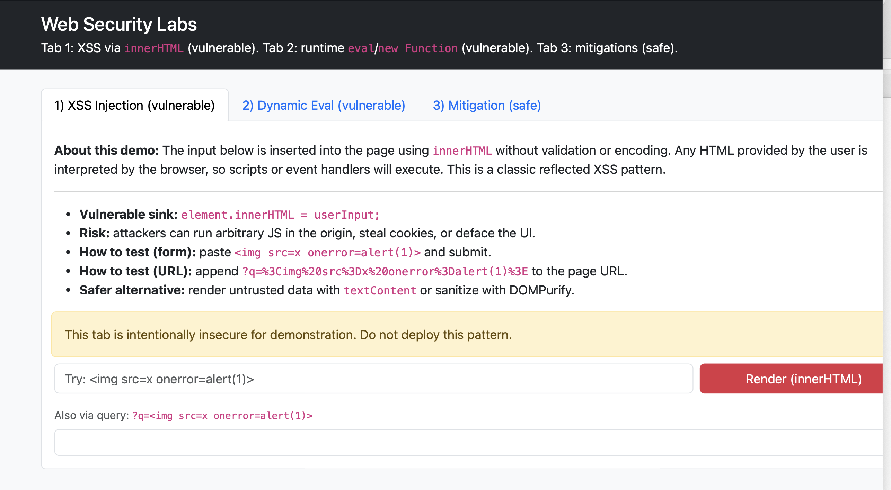
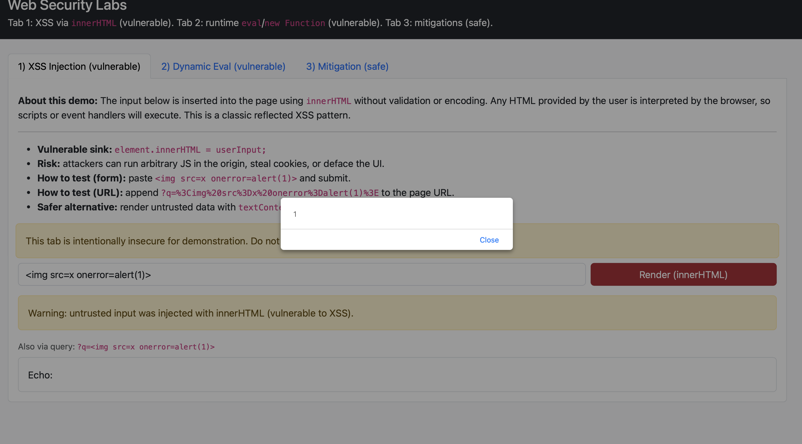
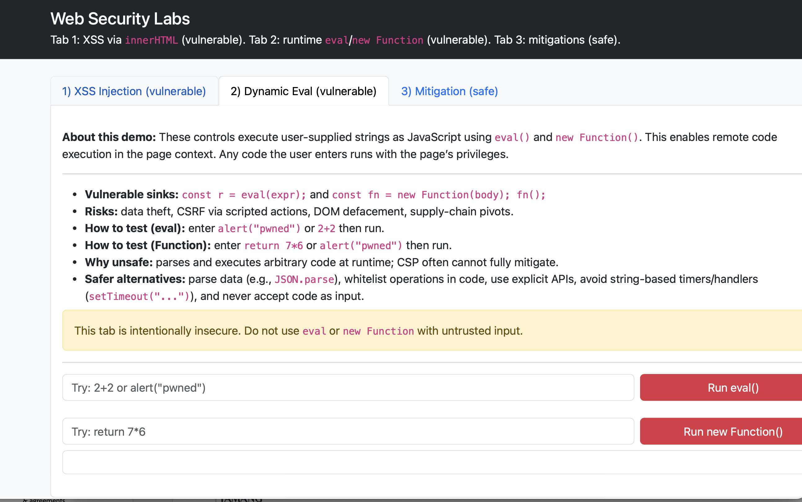
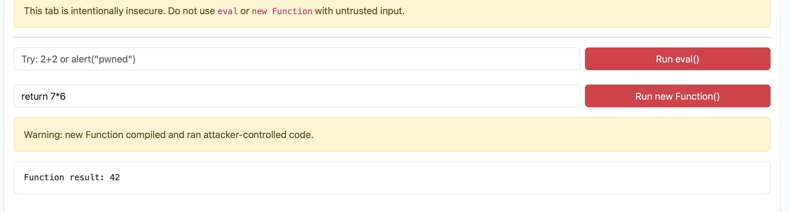
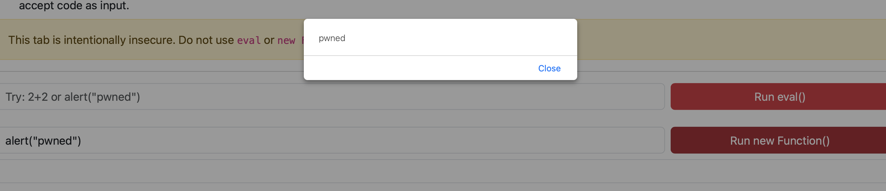
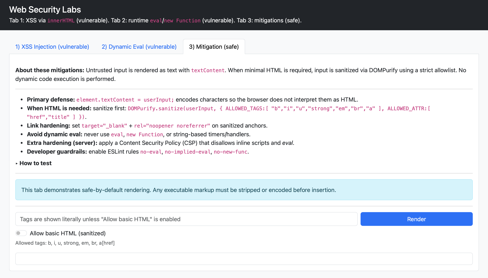

# Web Security Labs: XSS and Runtime `eval()` (with Mitigations)

Demonstrates two client-side vulnerabilities and safe fixes using pure HTML + JS.

## Files
index.html # Bootstrap UI with 3 tabs
app-xss.js # 1) XSS via innerHTML (vulnerable)
app-eval.js # 2) Dynamic eval/new Function (vulnerable)
app-fix.js # 3) Safe patterns + DOMPurify option

## How to run
Open `index.html` in a browser, or serve statically (any tool is fine):
```bash
npx http-server -p 8080
# visit http://localhost:8080
```


##  output will be something like below screenshot:


## Description on how to run dynamic evaluation

## Output will be as follows



